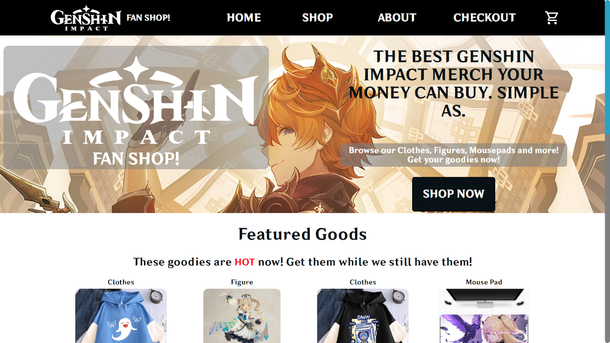
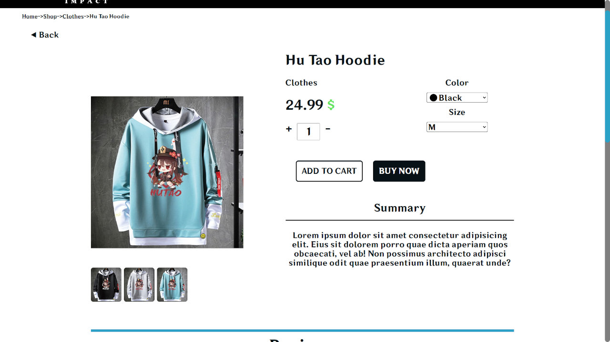

## 📌 Overview
A webshop based around a popular game Genshin Impact. It was bulit as a learning project to improve skills with the React framework.

## 🛠️ Tech Stack
- Frontend: React

## 🚀 Features
- Add/remove/edit items in cart
- Responsive design
- Features multiple products with various sizes, colors etc

## 📸 Screenshots

	
	

## 🔗 Live Demo
[Demo Link](https://nenopr.github.io/shopping-cart-OdinProject/)
